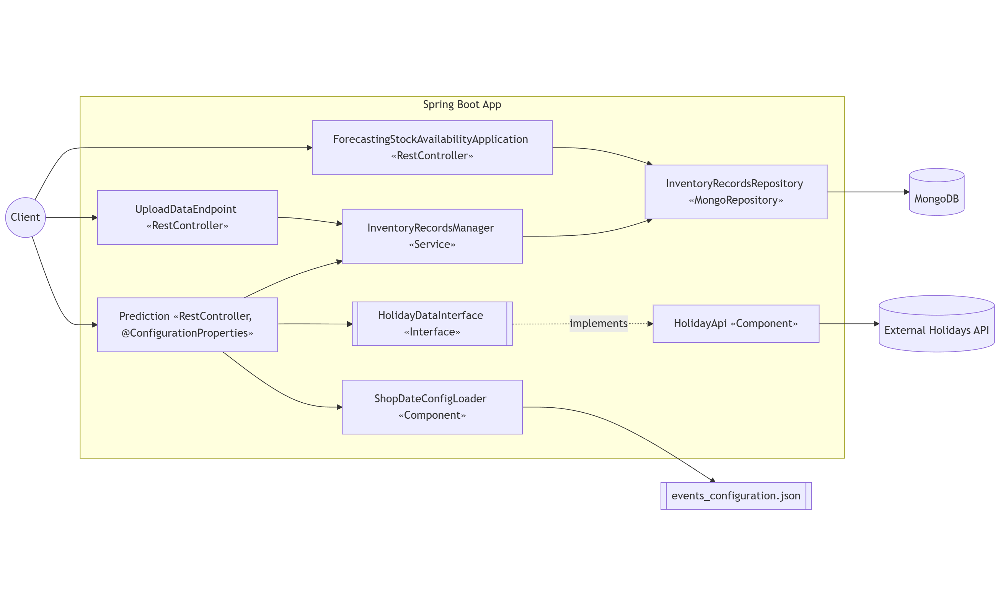
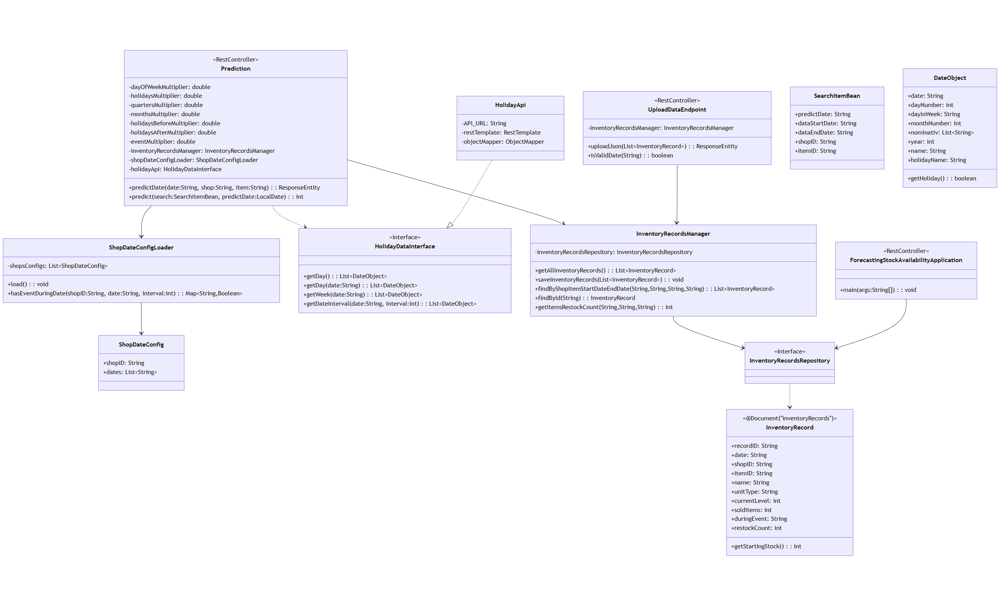

# System Architecture Document: SAR‑E Forecasting Stock Availability

## Overview

The application is a Spring Boot 3 (Java) web service that:

- stores daily inventory records in MongoDB,
- predicts future stock levels based on historical data and calendar/event features,
- retrieves public holiday information from an external API,
- provides a bulk data upload endpoint and a couple of helper endpoints for local testing.

Key packages:

- `com.example.forecasting_stock_availability.DB` – database access (MongoRepository + service layer).
- `com.example.forecasting_stock_availability.shop` – domain model (`InventoryRecord`).
- `com.example.forecasting_stock_availability.prediction` – REST controller and prediction logic (`Prediction`).
- `com.example.forecasting_stock_availability.dataupload` – REST endpoint for data upload (`UploadDataEndpoint`).
- `com.example.forecasting_stock_availability.data_client` – external holidays API client (`HolidayApi`,
  `HolidayDataInterface`, `DateObject`).
- `com.example.forecasting_stock_availability.eventconfig` – loads business event dates from JSON (
  `ShopDateConfigLoader`, `ShopDateConfig`).

The application boots via `ForecastingStockAvailabilityApplication` and includes 2 helper endpoints for local CSV import
and data cleanup.

---

## Architecture and Data Flows

### 1) Persistence Layer (MongoDB)

- Repository: `InventoryRecordsRepository extends MongoRepository<InventoryRecord, String>`
    - Custom query: `findByShopItemStartDateEndDate(shopID, itemID, startDate, endDate)` – finds records within an
      inclusive date interval using the `date` field (format `YYYY‑MM‑DD`; lexicographic comparison works for ISO
      dates).
- Service: `InventoryRecordsManager`
    - `getAllInventoryRecords()` – load all.
    - `saveInventoryRecords(List<InventoryRecord>)` – bulk save.
    - `findByShopItemStartDateEndDate(...)` – delegates to the repository.
    - `getItemsRestockCount(date, shopID, itemID)` – returns `restockCount` by composed ID.

Document ID (`@Id`) is a composite: `recordID = date + "-" + shopID + "-" + itemID`.

### 2) Domain Model: `InventoryRecord`

Fields:

- `recordID` (Id) – `date-shopID-itemID`.
- `date` – `YYYY-MM-DD`.
- `shopID`, `itemID`, `name`.
- `unitType` – e.g., `"ks"` (pieces).
- `currentLevel` – current stock level (int).
- `soldItems` – items sold during the day (int).
- `duringEvent` – "0/1" if item was sold during an event
- `restockCount` – items restocked during the day (int).

MongoDB collection: `inventoryRecords`.

### 3) External Integration Layer (Public Holidays)

- Config: `application.properties` key `holidays.getHolidays` (holidays API base URL, e.g., `http://.../holidays/`).
- `RestTemplate` bean in `WebConfig`.
- `HolidayApi implements HolidayDataInterface`:
    - Methods: `getDay()`, `getDay(String date)`, `getWeek(String date)`, `getDateInterval(String date, int interval)`.
    - Calls the external API and returns a list of `DateObject`. Handles both single-object and array JSON responses.

### 4) Event Configuration (date of future events)

- File: `src/main/resources/events_configuration.json` – list of shops and their event dates.
- Loader: `ShopDateConfigLoader`
    - `@PostConstruct load()` – reads JSON from classpath and sorts dates per shop.
    - `hasEventDuringDate(shopID, date, interval)` – returns a map date→true for dates within `[date, date+interval]`.

### 5) Prediction Logic and Weights

- Controller/Component: `Prediction` (`@RestController`, `@ConfigurationProperties(prefix = "prediction")`).
- Configurable multipliers (double):
    - `dayOfWeekMultiplier`, `monthsMultiplier`, `quartersMultiplier`, `holidaysMultiplier`, `holidaysBeforeMultiplier`,
      `holidaysAfterMultiplier`, `eventMultiplier`.
- Inputs:
    - Historical records from `InventoryRecordsManager` covering the last 24 months (default
      `dataStartDate = today - 730 days`, `dataEndDate = today`).
    - Holiday information from `HolidayDataInterface` (holiday day itself, the day before, the day after).
    - Future events from `ShopDateConfigLoader`.
- Aggregations/Averages:
    - by day of week, by month, by quarter, on holidays, day-before-holiday, day-after-holiday, and event days.
- The final prediction is an integer combining weighted averages of the relevant features.

### 6) Component diagram



### 7) Class diagram




---

## REST API – Endpoints and Contracts

### 1) Stock Level Prediction

- Endpoint: `GET /predict/{date}/{shop}/{item}`
- Path parameters:
    - `date` – `YYYY-MM-DD`, must be today or within the next 7 days (inclusive of today).
    - `shop` – shop identifier.
    - `item` – item identifier.
- Behavior/validation:
    - If `date < today` → `400 Bad Request`: `"Invalid date. Provide must not be in past"`.
    - If `date > today + 7` → `400 Bad Request`: `"Cannot predict more than 7 days into the future"`.
    - If insufficient historical data → `400 Bad Request`: `"Not enough data found for prediction! ..."`.
- Response 200 (JSON):
  ```json
  {
    "date": "2025-12-15",
    "shopID": "S001",
    "itemID": "P0001",
    "predicted": 42
  }
  ```

### 2) Bulk Upload of Inventory Records

- Endpoint: `PUT /upload`
- Request body: JSON array of `InventoryRecord` objects.
    - Per-item validation:
        - `date` required and ISO format (`YYYY-MM-DD`).
        - `shopID` required.
        - `itemID` required.
        - `duringEvent` required (string; expected values "0"/"1").
    - For each item, the server sets `recordID = date + "-" + shopID + "-" + itemID`.
- Responses:
    - `200 OK`: text `"Uploaded: N records."`.
    - `400 Bad Request`: plain text describing the first validation error, e.g.,
      `"Date format is invalid for record: {...}"`.
- Example request:
  ```json
  [
    {
      "date": "2025-12-12",
      "shopID": "S001",
      "itemID": "P0001",
      "name": "Electronics",
      "unitType": "ks",
      "currentLevel": 120,
      "soldItems": 30,
      "duringEvent": "0",
      "restockCount": 50
    }
  ]
  ```

### 3) Testing Endpoints

- `GET /upload-csv` – loads local file `retail_store_inventory.csv`, maps rows to `InventoryRecord` (skips
  header), saves to DB. Returns: `"uploaded CSV into DB"`.
- `GET /delete-all` – deletes all documents from the collection. Returns: `"deleted all DB"`.
  Note: Intended for testing purposes.

---

## Configuration

- `application.properties`:
    - `holidays.getHolidays` – base URL of the external holidays API (e.g., `http://example/api/holidays/`).
    - `prediction.dayOfWeekMultiplier`, `prediction.monthsMultiplier`, `prediction.quartersMultiplier`,
      `prediction.holidaysMultiplier`, `prediction.holidaysBeforeMultiplier`, `prediction.holidaysAfterMultiplier`,
      `prediction.eventMultiplier` – weights for prediction components.
    - MongoDB configuration (standard Spring Data Mongo properties, e.g., `spring.data.mongodb.uri=...`) – not shown in
      repo, expected to be provided at deploy time.

---

## Behavioral notes

- Prediction relies on 24 months of historical data; data availability and consistency are critical.
- Date comparisons in Mongo queries rely on ISO text dates `YYYY-MM-DD`; keep the format, otherwise results may be
  incorrect.
- `upload-csv` and `delete-all` endpoints are explicitly for testing.
- Atribute `restockCount` is used to store restocking data. The database may contain records of restocking planned for the future.

---

## Sequence Views

1. Data Upload (`PUT /upload`):

    - Client → `UploadDataEndpoint.uploadJson()` → validation → set `recordID` →
      `InventoryRecordsManager.saveInventoryRecords()` → MongoDB.

2. Prediction (`GET /predict/{date}/{shop}/{item}`):

    - Client → `Prediction.predictDate()` → date validation → compose `SearchItemBean` with last 24 months → load
      historical
      records via `InventoryRecordsManager` → load holidays (`HolidayDataInterface`) and events (
      `ShopDateConfigLoader`) → compute weighted averages → return JSON with `predicted`.

3. Startup:

    - App startup loads `events_configuration.json` → dates sorted → prediction uses
      `ShopDateConfigLoader.hasEventDuringDate(...)` to check if the window contains a shop event.

---

## Example Requests

- Prediction:
  ```bash
  curl "http://localhost:8080/predict/2025-12-15/S001/P0001"
  ```
- Data upload:
  ```bash
  curl -X PUT "http://localhost:8080/upload" \
       -H "Content-Type: application/json" \
       --data @data.json
  ```

---