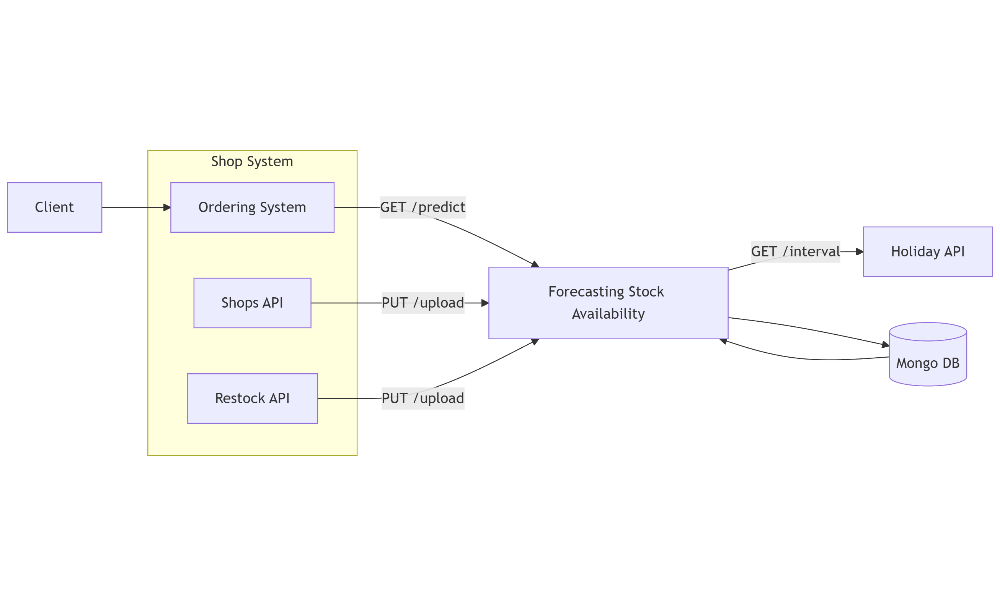

# Forecasting Stock Availability

---

## Objectives

In retail, it is often necessary to estimate how much of a specific product will be available in a particular store on a
given future date. The goal of this project is to design an architecture and implement a proof-of-concept of a service
that provides such forecasts via a REST API.

The service should expose an endpoint that, for a given product ID, unit of measure, store ID, and a target date (within
the next 7 days), returns the expected stock quantity of the product available in that store on that date. The
prediction must be based on available input data (e.g., historical stock levels, current stock, deliveries, etc.) and
implemented using deterministic logic (no AI/ML models).

Objectives

- Analyze and document relevant input data sources (e.g., stock movements, delivery schedules, sales).
- Develop a rule-based or statistical prediction algorithm.
- Propose and document an architecture for the service and integration with other services providing input data.
- Design a REST API for querying expected stock levels per store.
- Design an API for integration with other services providing input data.
- Evaluate and justify which database should be used for data persistence.
    - Compare relational database (e.g., PostgreSQL) and document-oriented database (e.g., MongoDB)
    - Consider factors such as data structure, size and query complexity.
    - Provide a recommendation with reasoning
- Deliver a working PoC implementation with simulated or static data.

---

## Technologies

### Java & Spring Boot

The service is built using **Java 17+** and **Spring Boot**, leveraging its robust ecosystem for REST APIs and data
persistence.

### Considered DB

#### MySQL

MySQL is an open-source relational database management system (RDBMS) widely used in web applications. It is known for
being fast, reliable, and easy to use, and is a core part of the LAMP stack.

**Advantages**:

- Easy to learn and use
- High performance for read-heavy workloads
- Widely supported by hosting providers
- Large community and ecosystem
- Well-integrated with web technologies

**Disadvantages**:

- Limited advanced SQL features compared to PostgreSQL
- Less flexible for complex queries
- Some features require paid editions
- Weaker support for complex transactions

#### PostgreSQL

PostgreSQL is open-source object-relational database known for standards compliance, data integrity, and
advanced features. It is often chosen for complex, enterprise-grade systems.

**Advantages**:

- Strong ACID compliance
- Advanced SQL features (CTEs, window functions)
- Excellent performance for complex queries
- Supports JSON & hybrid relational models
- Highly extensible (custom data types, functions)

**Disadvantages**

- Steeper learning curve
- Slightly slower for simple read-heavy workloads
- More complex configuration
- Higher resource usage than MySQL

#### MongoDB

MongoDB is a NoSQL document database that stores data in JSON-like BSON documents. It is designed for scalability,
flexibility, and rapid development.

**Advantages**:

- Schema-less and flexible
- High performance for large datasets
- Horizontal scalability (sharding)
- Developer-friendly JSON structure
- Strong community and ecosystem

**Disadvantages**

- Data duplication due to denormalization
- Limited support for complex joins
- Higher memory usage
- Eventual consistency in distributed setups

#### CouchDB

CouchDB is an open-source document database that uses JSON for documents, HTTP/REST for access, and is designed for
offline-first and distributed systems.

**Advantages**:

- Simple REST-based API
- Offline-first with data synchronization
- Flexible schema
- Built-in replication
- Easy integration with web and mobile apps

**Disadvantages**

- Slower query performance
- Limited querying compared to MongoDB
- Smaller community
- Not ideal for complex analytics

### Selected database: MongoDB

After evaluating different databases, **MongoDB** was chosen for this PoC
for the following reasons:

- **Scalability**: MongoDB's horizontal scaling capabilities are well-suited for large volumes of time-series inventory
  data.
- **Performance**: High-speed writes for bulk data uploads.
- **Integration**: Easy integration with Spring Boot via Spring Data.
- **Experience**: We have prior experience with MongoDB, which made it a good solution for this project.

---

### External APIs

- **Holiday API**: Used to fetch public holiday data, which significantly impacts retail sales patterns.

---

## Algorithm

The prediction algorithm is deterministic and operates by simulating inventory changes day-by-day from the current date
to the target date.

### Logic Steps:

1. **Data Retrieval**: Fetches historical data for the specific shop and item for the last 2 years.
2. **Feature-Based Averaging**: Calculates average sales for various contexts by grouping historical records:
    - Day of the Week
    - Month
    - Quarter
    - Holidays (Day of, Day Before, Day After)
    - Special Events (e.g., Black Friday, Cyber Monday)
3. **Application of Weights**: Each context-based average is adjusted using a configurable **multiplier (weight)** to
   reflect its relative impact on sales.
4. **Daily Simulation**: For each day until the target date:
    - Identifies the context of the day (e.g., "Is it a holiday?", "Is it a Monday?").
    - Aggregates relevant weighted historical averages to estimate expected sales.
    - Updates the simulated stock: `Stock(t) = Stock(t-1) - EstimatedSales(t) + Restock(t)`.
    - Estimated sales:
      `EstimatedSales(t) = (DayOfTheWeekAverage(t) * DayOfTheWeekMultiplier) + (MonthAverage(t) * MonthMultiplaier) + ... (EventAverage(t) * EventMultilier)`
5. **Constraints**: Predictions are limited to a 7-day future window to maintain accuracy.

---

## Architecture

### System Components

#### **Client**
   Purpose:
   - Represents the end user or external consumer of the system.

   Responsibilities:
   - Initiates requests to place orders or check product availability.
   - Interacts only with the Ordering System, not with internal services directly.

   Interactions:
   - Sends requests to the Ordering System (e.g., product order or availability checks).

---

#### **Forecasting Stock Availability**
   Purpose:
   - Central service responsible for predicting future stock availability.

   Responsibilities:
   - Collects data from shops, restocking systems, and external factors.
   - Runs forecasting logic.
   - Provides availability predictions to the Ordering System.

   Interactions:
   - Receives shop data via PUT /upload from:
     - Shops API
     - Restock API
   - Requests holiday information from the Holiday API using GET /interval.
   - Reads from and writes to MongoDB.
   - Serves prediction results to the Ordering System via GET /predict.

---

#### **Shop System**
   Purpose:
   - Manages operational shop-related data.

   Responsibilities:
   - Collects and maintains shop inventory and restocking information.
   - Acts as a source of truth for raw operational data.

   Subcomponents:
   - Shops API
   - Restock API
   - Ordering System

   Interactions:
   - Shops API → Forecasting Stock Availability
     - Sends current shop and inventory data via PUT /upload.
   - Restock API → Forecasting Stock Availability
     - Sends restocking schedules and quantities via PUT /upload.
   - Ordering System → Forecasting Stock Availability
     - Requests stock availability predictions via GET /predict.
   - Ordering System ← Forecasting Stock Availability
     - Receives forecasted availability results to support order decisions.

---

#### **Shops API**
   Purpose:
   - Provides current shop and inventory-related data.

   Responsibilities:
   - Exposes shop stock levels and operational data.
   - Pushes updates to the forecasting service.

   Interactions:
   - Sends inventory data to Forecasting Stock Availability via PUT /upload.

---

#### **Ordering System**
   Purpose:
   - Acts as the main entry point for order-related operations.

   Responsibilities:
   - Receives client requests.
   - Requests stock availability predictions before confirming an order.
   - Uses forecast results to decide whether an order can be accepted or delayed.

   Interactions:
   - Calls Forecasting Stock Availability using GET /predict.
   - Returns prediction result.

---

#### **Restock API**
   Purpose:
   - Provides information about restocking events.

   Responsibilities:
   - Tracks restocking schedules, quantities, and deliveries.
   - Ensures forecasting logic is aware of incoming stock.

   Interactions:
   - Sends restocking data to Forecasting Stock Availability via PUT /upload.

---

#### **Holiday API**
   Purpose:
   - Supplies external calendar and holiday information.

   Responsibilities:
   - Provides holiday intervals that may affect demand patterns.
   - Helps improve prediction accuracy by accounting for seasonal effects.

   Interactions:
   - Responds to Forecasting Stock Availability requests via GET /interval.

---

#### **MongoDB**
   Purpose:
   - Persistent data storage for the forecasting service.

   Responsibilities:
   - Stores historical inventory data.
   - Stores future restock inventory data

   Interactions:
   - Read/write access by Forecasting Stock Availability.

---

### API Endpoints

- `GET /predict/{date}/{shopID}/{itemID}`: Returns the predicted stock level.
- `PUT /upload`: Accepts a JSON list of `InventoryRecord` objects for bulk data ingestion.

---

## Conclusion

This PoC successfully demonstrates a deterministic approach to stock forecasting. By combining historical sales averages
with context-aware triggers (holidays, events), the service provides actionable insights for retail inventory management
without the overhead of machine learning models. The choice of MongoDB ensures the system can handle the high-throughput
requirements typical of retail data processing.

